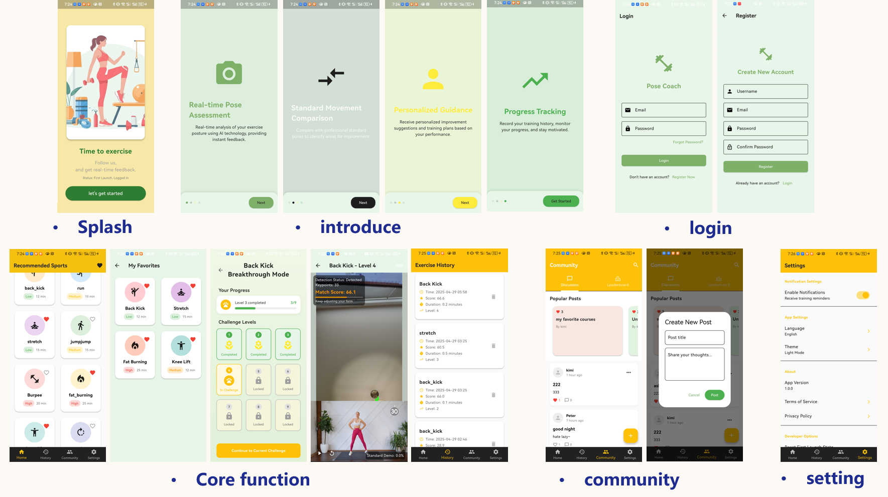

# PerfectFit

It is a mobile fitness assistance application based on Flutter + ML Kit/MediaPipe. 

It uses the mobile phone camera to perceive the environment, and uses the human body key point recognition technology to compare and analyze the user's current posture with the movements in the standard demonstration video, and give feedback in the form of scores. 

Through this system, users can exercise independently at home, and the system plays the role of "AI coach", prompting irregular movements in real time and guiding users to improve.

  
  
Storyboard

## Landing Page 
[Click here to see Landing Page](https://jinming2333.github.io/0015-FitPerfect/)

## Screens

  
  
Screens

 

## Video Instruction
[Click here to see Video](https://youtube.com/shorts/Q8AwVCKNhBY?feature=share)

## How To Install The App

Due to some plugin version conflicts, we are currently unable to provide a pre-built `.apk` file under the "Releases" section. Therefore, to install and run this app on your mobile device, please follow these steps:

1. **Clone this GitHub repository** to your local machine.
2. **Connect your Android device** via USB and ensure that USB debugging is enabled.
3. Make sure you have **Flutter installed and properly configured** on your system.
4. Navigate to the project directory in your terminal and run: 
    flutter pub get  
    flutter run

This will build and install the app directly onto your connected device.

> Note: This project uses Flutter with ML Kit. Make sure your environment supports these dependencies. You can check `pubspec.yaml` for the specific plugin versions being used.

