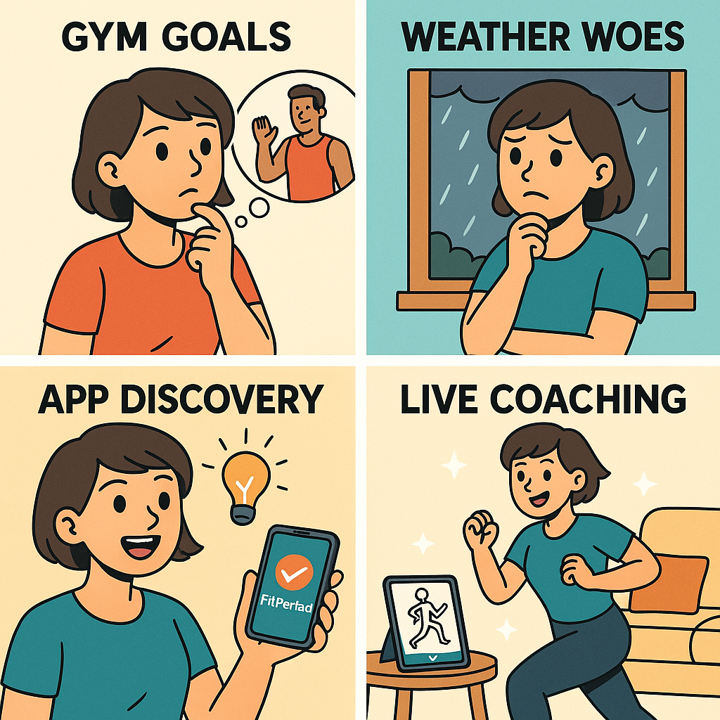
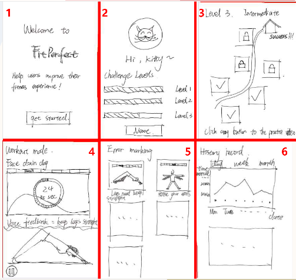

# PerfectFit

It is a mobile fitness assistance application based on Flutter + ML Kit/MediaPipe. 

It uses the mobile phone camera to perceive the environment, and uses the human body key point recognition technology to compare and analyze the user's current posture with the movements in the standard demonstration video, and give feedback in the form of scores. 

Through this system, users can exercise independently at home, and the system plays the role of "AI coach", prompting irregular movements in real time and guiding users to improve.

  
  
Storyboard

## Landing Page 
[点击查看 Landing Page 页面](./index.html) 

## Landing Page 

Use this section to show us what your Mobile App is about.   Include a Screenshot to the App, link to the various frameworks you've used. Include your presentation video here that shows off your Mobile App.   Emojis are also fun to include 📱 😄

## Video Instruction

## How To Install The App

Include a section that gives intructions on how to install the app or run it in Flutter.  What versions of the plugins are you assuming?  Maybe define a licence

##  Contact Details

Having Contact Details is also good as it shows people how to get in contact with you if they'd like to contribute to the app. 

