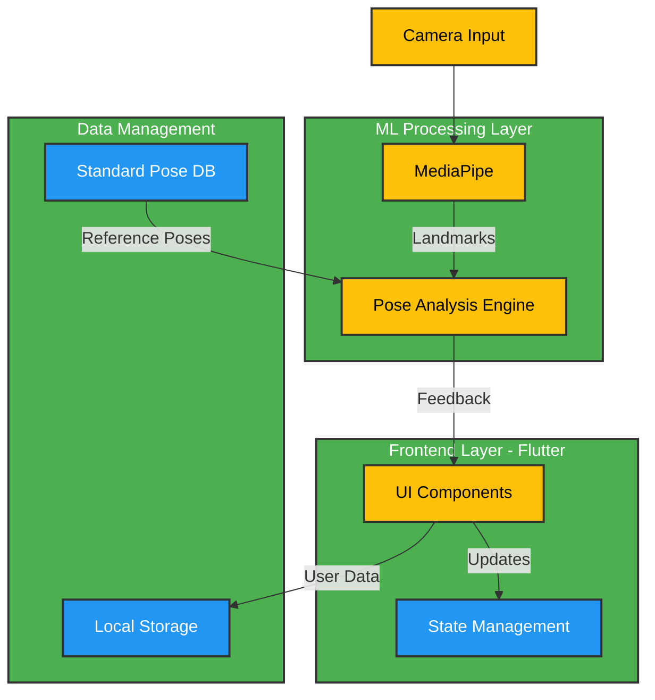

```mermaid
graph TD
    subgraph Frontend[Frontend Layer - Flutter]
        UI[UI Components]
        SM[State Management]
        UI --> |Updates| SM
    end

    subgraph ML[ML Processing Layer]
        MP[MediaPipe]
        PA[Pose Analysis Engine]
        MP --> |Landmarks| PA
    end

    subgraph Data[Data Management]
        LS[Local Storage]
        SPD[Standard Pose DB]
    end

    %% Main data flow
    Camera[Camera Input] --> MP
    PA --> |Feedback| UI
    SPD --> |Reference Poses| PA
    UI --> |User Data| LS

    %% Styling
    classDef primary fill:#4CAF50,stroke:#333,stroke-width:2px,color:white
    classDef secondary fill:#FFC107,stroke:#333,stroke-width:2px,color:black
    classDef tertiary fill:#2196F3,stroke:#333,stroke-width:2px,color:white

    class Frontend,ML,Data primary
    class Camera,UI,MP,PA secondary
    class LS,SPD,SM tertiary
``` 